# AI Design Studio — System Design Document

**Final Deliverable (Prompt Part 8 / 13.txt).** Enterprise system design for the AI Design Studio: a CAD-learning + Indian-modular-kitchen design-generation platform with direct CAD-style editing, multi-elevation coordination, production documentation (cut list / hardware / BOQ), and a 3D visualization engine (now built client-side on Three.js).

**Hard constraint (enforced throughout):** NO cutting optimizer, NO nesting optimizer, NO beam-saw workflow, NO CNC sheet optimization, NO panel-cutting optimization. The production **panel cut list is component reporting / documentation only** — never a cutting-optimization workflow.

**Legend for build state:** OK *Implemented* (live in `index.ts`) · ~ *Partial* (hooks exist, noted as production upgrade) · 3D *Designed (roadmap)* — specified here, not yet built.

> **Status update (2026-06-01).** The **3D Modeling & Visualization Engine is now built client-side** on Three.js (r128, CDN) + OrbitControls — interactive in-browser, not the originally-designed server REST/WS endpoints. Implemented: 2D→3D extrusion (§4.14), material/finish presets (§4.16), lighting presets + soft-shadow WebGL render + PNG export (§4.17), scene population (§4.18), orbit walkthrough (§4.19), plus doors/windows/beams and wall-property editing in both 3D and 2D, and top-view dimension editing. What remains **roadmap**: the server-side 3D endpoints (§3.2) and `room_models`/`render_jobs` **persistence** (the scene is rebuilt from the shared in-memory `runs` state, not stored), the **offline photoreal render queue**, **walkthrough video encode** (interactive orbit ships), and the **WebSocket multi-*client* propagation bus** (single-client multi-*view* sync ships). Rows below are tagged accordingly.

> **Status update (2026-06-11).** **Enterprise extensions shipped (§3.2 pending items #1–#8 + the Risk #9 validation gap).** A new server section (`// 11. ENTERPRISE EXTENSIONS`) plus client wiring closes the long-standing "capability ships client-side, server/scale form pending" gaps: **(#1) Canvas-edit persistence** — `PUT /api/designs/:id/layout` (canvas autosave, debounced 700 ms) + `PATCH .../cabinet`, `.../cabinet/:i/props`, `.../dimension`; each loads the row, mutates the shared model, **re-derives** cut list / hardware / BOQ / mfg-checks + re-renders elevations, persists, audits, and broadcasts. **(#2) Realtime bus** — a dependency-free **Server-Sent Events** fan-out (`GET /api/designs/:id/live`) with `broadcast(designId,event,data)`, heartbeat, live-presence count, and a "● Live · autosaved" badge; other tabs apply pushed diffs to the single source of truth (echo-guarded by per-tab `clientId`). **(#3) RoomModel coordination** — `POST /api/designs/:id/coordinate` builds walls[]↔runs + sharedCorners[], auto-rebalances the affected run(s), syncs corner returns, persists to `room_models`, broadcasts (`GET /api/designs/:id/roommodel`). **(#4) Offline render queue** — `render_jobs` table + in-process worker (`POST /api/designs/:id/3d/render`, `GET /api/render/jobs[/:jid][/file]`) decoupling Stability renders from the request. **(#5) PBR material pipeline** — `materials` table + an 8-entry PBR library (albedo/roughness/metalness/clearcoat/normalScale/ao/transmission/…); `POST/GET /api/designs/:id/3d/material` + `GET /api/pbr/library` store and serve addressable per-target material sets. **(#6) Walkthrough encode** — `POST /api/designs/:id/3d/walkthrough` plans an interpolated orbit camera path and, given captured frames, a job **encodes a real animated GIF server-side** via a from-scratch in-file **PNG→RGBA decoder + median-cut palette + GIF-LZW encoder** (zero native deps). **(#7) Obstruction multi-view** — `POST /api/designs/:id/obstruction` trims clashing wall/tall heights across all runs, re-rebalances, re-derives every view, persists + broadcasts. **(#8) Generalized dimension overlap solver** — `levelIntervals()` (optimal interval-graph leveling) staggers colliding dimension lines onto minimal stack levels, now driving the socket-dimension chain. **Validation (Risk #9):** `validateManufacturing` gains **Handle-collision clearance** (corner-pinch + tall-door knuckle clash; handle-less systems report clean) and **Appliance-swing clearance** (fridge/dishwasher/oven door & drop arc vs. corner returns and adjoining appliances). New persistence tables: `room_models`, `materials`, `render_jobs`. **Client UI wired:** `Room3D` gains a **🎞 Walkthrough GIF** button (captures a 24-frame orbit → queues the encode → downloads the GIF) and a **🎨 Save finish (PBR)** button (persists the current brand finish as an addressable PBR set); the Generator shows the **● Live · autosaved** badge and autosaves every edit. A **🏗 Structure & production jobs** panel (`StructurePanel`) under the result exposes the remaining API-only items: a **beam/obstruction** form (#7, drop + wall → trims + lists adjustments), a **Rebalance + sync corners** button (#3 coordinate → RoomModel summary), and a live **render-queue** list (#4, status/progress + download links, auto-polled). Applying a beam now **renders a dashed soffit band** (with the trimmed-unit count) across the affected elevations — `applyObstruction` stamps `run._obstruction` and `renderRunElevation` draws it, so the obstruction is visible in the drawing/DXF export, not just the data (#7 visual loop closed). **#5 closed end-to-end:** stored/synced PBR materials now **drive the live Three.js fronts** — Room3D loads `/api/designs/:id/3d/materials` on mount, merges the PBR set (albedo/roughness/metalness/clearcoat/envMap) into the front `MeshPhysicalMaterial`, and re-skins on change; the **🎨 Save finish (PBR)** button applies instantly and the Generator SSE bus relays `material` events (via an `ads-material` window event) so other tabs re-skin too. Verified `verify-ent-pbr.mjs` 5/5 (apply → toast → scene rebuild). **#4 UX completed:** the StructurePanel render-queue now has a **👁 view** action that shows the finished artifact **inline** (photoreal PNG or walkthrough GIF) with a download link, not just a bare download. **Design version history:** `design_versions` table + `POST /api/designs/:id/version` (snapshot), `GET .../versions` (list w/ summary), `POST .../restore/:vid` (restore — auto-snapshots the current state first so a restore is itself undoable); a **Version history** section in the StructurePanel (📸 Snapshot + ↩ restore). Full suite **50/50** (`verify-ent` 20, `-ui` 5, `-ui3d` 5, `-struct` 6, `-pbr` 5, `-view` 5, `-ver` 4). Repo initialized (git, branch `master`, `.gitignore` excludes ai-keys.json/*.db/binaries/scratch). Verified: `verify-ent.mjs` 20/20 (incl. a real `GIF89a` encode) + `verify-ent-ui.mjs` 5/5 + `verify-ent-ui3d.mjs` 5/5 + `verify-ent-struct.mjs` 6/6 headless (clean render, live badge, autosave, 3D buttons, real in-browser GIF job → done, beam/coordinate/jobs panel).
>
> **Status update (2026-06-05).** Major 3D/rendering expansion (driven by the "Rules to Follow by Claude" AI-video production rules): (a) **Brand finish library** (§4.16) — showroom Type → Brand → Shade cascade: Acrylic (Merino · Greenlam · Senosan · Rehau), Laminate (Merino · Greenlam · Century · Royale Touche), Veneer (Greenlam Decowood · CenturyVeneers · Duro), PU paint (AICA · Action Tesa · Sirca · Asian Paints), ~60 shades with per-type PBR params; the selected finish name flows into photoreal prompts, the storyboard and the spec card. (b) **Live accessory mechanisms** — every workable front is a real moving part: doors swing on hinge pivots, drawer banks/bottle-pull-outs glide out with wire baskets + contents (atta dabba, cutlery trays, plates, bottles), tall pantries open + slide baskets, the corner carousel spins; "🎛 Demo accessories" opens everything, and **clicking any single front toggles just that cabinet** with a smooth **auto-zoom** camera flight (fly-back on close); animation is time-based (frame-rate independent). (c) **AI photoreal rendering ships** — `POST /api/render/photoreal` (Stability AI structure control): single render, 360° turntable spin, and an automatic **close-up open-accessory mode** (close-up prompt + ≥0.82 control strength when a mechanism is open). (d) **Cinematic camera presets + AI-video storyboard** — named angles (hero/front/corners/close/top) and a 🎬 generator converting the live layout into Seedance 2.0/Veo 3-ready Segment prompts (Script + Video Prompt + continuity) with per-segment HD reference frames. (e) **2D export sheet** — `combinedSvg` now wraps plan/elevations/sections in a double-border CAD sheet with a 4-cell title block. (f) WebM **walkthrough/demo recording** in-app (canvas captureStream).

---

## 0. Scope & current footprint

The shipped product is a **single-file full-stack app** (`index.ts`, run via `npm start` -> `tsx`, port 3000): Hono server + Drizzle/SQLite + Zod, with a React/Tailwind/Babel CDN frontend served as one HTML document. It already implements prompt docs 1-12: the learning engine, six-category rule framework, all mandatory Indian modular kitchen rules (5.1-5.8), six kitchen shapes + furniture, direct CAD-style editing on the canvas, AutoCAD-style dimensions, beam handling, handle/profile systems, production cut list, hardware schedule, BOQ, and manufacturing validation. This document describes that system and the enterprise architecture it scales into. The **3D Modeling & Visualization Engine** is now **implemented client-side** (Three.js, in-browser — see the Status update above); **full cross-*client* multi-view propagation** (the WebSocket bus) remains designed here (3D).

---

## 1. System Architecture

### 1.1 Textual overview

Three logical tiers, deployable as one process today (OK) and as separable services at scale (3D):

- **Presentation** — React SPA (single served document): Generator, Library (drawing upload + learning), What-AI-Learned, Command Center (rule toggles), Admin Dashboard. The **canvas** (`InteractiveElevation`) is both viewer and editor; the **`Room3D`** component renders the live Three.js scene (3D view, walkthrough, material/lighting presets, PNG export) and a second Three.js scene drives wall/structural editing with raycast selection.
- **Application / Domain** — Hono HTTP API + the deterministic **design engine** (rule resolution -> planning -> sizing -> rendering), the **learning engine** (drawing analysis -> rule extraction -> reinforcement), the **export engine** (SVG/DXF/PDF/CSV), and the **validation engine** (mandatory + manufacturing checks). The **3D engine** (2D→3D extrusion, materials, lighting, populate, walkthrough) runs **client-side** off the same shared `runs` model; only its server-endpoint/persistence form (§3.2) is roadmap.
- **Data** — SQLite (via Drizzle) holding the centralized **AI knowledge base**: references, rules (six fusion classes), designs, and an audit log. An in-memory `LEARNED`/`GEN` snapshot is the hot path.

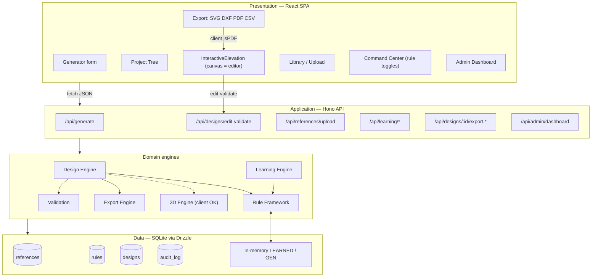

### 1.2 Request lifecycle (generation)

`POST /api/generate` -> Zod validation -> `buildLayout(type, dims)` sets the runtime `GEN` opts and resets the per-run audit (`GEN_LOG`) -> `refreshLearnedStandards()` pulls active rules into `LEARNED` -> shape dispatch builds runs -> tall units, mandatory + manufacturing validation, cut list / hardware / BOQ attached -> SVG renderers produce `planSvg` + `elevations[]` -> persisted to `designs` -> returned to the client, which mounts the Project Tree + `InteractiveElevation`.

---

## 2. Database Schema (centralized AI knowledge base)

SQLite via Drizzle ORM. Idempotent migrations (`ALTER` guarded by column probes) and idempotent rule seeding (`ensureRuleFramework`).

| Table | Column | Type | Notes |
|---|---|---|---|
| **references** | `id` | TEXT PK | content-hash dedup |
| | `name` | TEXT | original filename |
| | `kind` | TEXT | dwg/dxf/pdf/jpg/png/svg/skp/xml |
| | `size` | INTEGER | bytes (idempotent ALTER) |
| | `analysis` | TEXT(JSON) | `analyzeDrawing()` output |
| | `createdAt` | TIMESTAMP | |
| **rules** | `id` | TEXT PK | |
| | `category` | TEXT | placement/units/utilities/hardware/space-planning/appliance |
| | `rule_class` | TEXT | six classes: mathematical/manufacturing/appliance/space-planning/learned/company |
| | `title` | TEXT | matched by substring in `byTitle()` |
| | `text` | TEXT | machine-parsed parameters |
| | `confidence` | REAL | 0-0.99 (reinforcement-capped) |
| | `usageCount` | INTEGER | bumped by `reinforceStandards` |
| | `status` | TEXT | active / disabled (Command Center) |
| | `source` | TEXT | knowledge-base / uploaded-template |
| **designs** | `id` | TEXT PK | uuid |
| | `designType` | TEXT | "U-Shape Kitchen" |
| | `params` | TEXT(JSON) | wall/wallB/wallC/chimneyWidth/hob/dishwasher/hiunit/utility/handle |
| | `layout` | TEXT(JSON) | runs, appliedRules, learnedRules, planSvg, elevations, cutList, hardware, boq, mfgChecks, handle |
| | `createdAt` | TIMESTAMP | |
| **audit_log** | `id` | TEXT PK | |
| | `designId` | TEXT FK | also `edit-...` rows |
| | `tag` | TEXT | `[edit . type . run]` |
| | `kind` | TEXT | conflict / adjustment |
| | `message` | TEXT | mandatory/manufacturing finding |
| | `createdAt` | TIMESTAMP | drives Admin Dashboard |

3D **extension tables** (roadmap — *persistence only*; the live 3D scene already renders client-side from the in-memory `runs` model, these tables would store/scale it): `room_models` (3D scene graph JSON), `materials` (PBR maps), `cameras` (walkthrough keyframes), `render_jobs` (async render state).

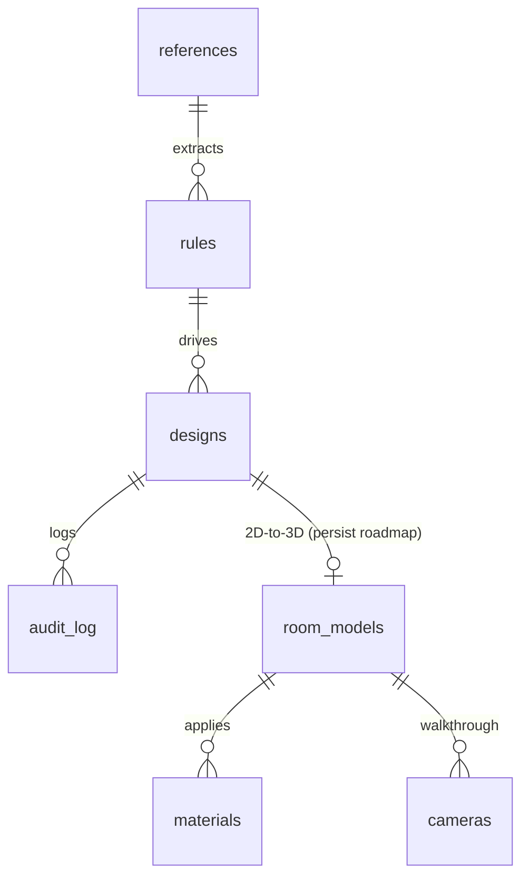

---

## 3. API Endpoints

### 3.1 Implemented (OK)

| Method . Path | Purpose |
|---|---|
| `POST /api/generate` | Design generation applying all mandatory rules + Indian planning sequence |
| `POST /api/designs/edit-validate` | Validate a manually-edited base row; logs to `audit_log` |
| `POST /api/references/upload` | Multipart drawing upload; content-hash dedup; runs `analyzeDrawing` |
| `POST /api/references/:id/learn` | Per-drawing commands; "store as standard template" -> active rule |
| `POST /api/learning/scan` | Batch learning scan |
| `POST /api/learning/rules/:id/toggle` | Enable/disable a learned standard |
| `GET /api/designs/:id/export.svg` | Combined SVG (plan + elevations + corner legend) — the engineering CAD set |
| `GET·POST /api/designs/:id/spec-sheet.svg` | **Presentation spec sheet** (StudioNuvique-style 2D drawing): banner (+ "Prepared for: <client>" from `design_clients`), hero — a **rendered 3D/photoreal view** when supplied else the line elevation with **true leader-line callouts**, dimensioned plan + elevation, internal-layout/section (wardrobe inside view + depth section; mandir/wall-panel side views), construction **detailing drawings** (base/wall cabinet, L-corner, countertop+backsplash, sliding track), material-palette swatches (lead swatch = the user's **actual chosen finish**), specifications, **cutting list + hardware** (furniture), key features, notes, branded footer. POST body `{ finish?, hero? }` carries the live finish + rendered hero (hero validated to a strict raster data-URL — `data:image/svg+xml` rejected as an XSS guard, 413 body cap). `?inline=1` for the in-app preview; else download. Client: **📄 Spec Sheet** preview modal + **⬇ Spec Sheet PDF** (print-ready A3, 3× raster); also prepended as the first visual page of the **Full Proposal PDF**. Works for every design type. |
| `GET /api/spec-sheet/kitchens.svg` | **4-Type Modular Kitchen** comparison sheet — Straight/Parallel/L/U side by side (plan + elevation thumbnails + notes) with shared detailing + material palette + key features. Client: **📐 4-Type Kitchen Sheet**. |
| **Material Management Module** | `GET /api/materials(?category=&brand=&q=)` + `/api/materials/facets` — the Material Catalog ("Material DNA"): every finish (PU led by 114 Sirca/OIKOS Supercolor colours) with brand·collection·code·finishType·sheen·dealer/customer rate·out-of-stock. `POST /api/materials` (add), `/api/materials/import` (CSV bulk), `PATCH/DELETE /api/materials/:id` (rate/stock/delete) = §9 admin. `GET·PUT /api/designs/:id/material` (per-scope assignment, §4 Apply-To base/wall/tall/all; **§2 per-cabinet** `scope:"cabinet"` + `cabinetKey` "section:runIdx:arrayIdx" sets/clears ONE cabinet's own finish via a `cabinets` map preserved across all writes) → costed finish lines in the quote (face area × rate +15% wastage, §8/§13; overridden cabinets billed as a "Custom · per-cabinet" line and excluded from their scope aggregate) + per-cabinet material in the cut-list / cabinet-schedule / BOQ + Material schedule on the spec sheet + per-cabinet re-skin in the live 3D scene (🖌 Paint cabinet mode → click any cabinet). `GET/POST/DELETE /api/themes` + `POST /api/designs/:id/apply-theme` = §12 theme creator (5 built-ins). Client: **🎨 Material Catalog** modal (tabs, brand filter, search, swatches, Apply-To incl. "This cabinet", Themes, ⚙ Admin add/CSV/stock). |
| `GET /api/designs/:id/export.dxf` | Real-mm R12 DXF with discipline layers |
| `GET /api/designs/:id/cutlist.csv` | Cut list: S.No, Height, Width, Qty, Description |
| `GET /api/designs/:id/hardware.csv` | Hardware schedule |
| `GET /api/rate-card/default` | Built-in INR rate-card defaults (board/edgeband/hardware/margin/GST) |
| `GET·PUT /api/designs/:id/rate-card` | Per-design rate-card (upsert `rate_cards`); PUT re-prices + broadcasts `quote` |
| `GET /api/designs/:id/quote` | Priced quotation — rate-card × BOQ → INR lines + subtotal/margin/GST/total (deterministic, derived on read) |
| `GET /api/designs/:id/quote.csv` | Quotation as CSV (line items + Subtotal/Margin/Taxable/GST/Total, prefixed with the Bill To block). Also exportable client-side (jsPDF) as a branded **quotation PDF** (⬇ quote PDF) or a complete **proposal PDF** — cover + plan/elevations/sections drawings + quotation in one document (📋 Full proposal PDF). |
| `GET·PUT /api/designs/:id/client` | Per-design **client / "Bill To"** details (name/phone/email/site/ref/notes; `design_clients` table). Addressed onto the quote CSV header, the quote-PDF header band, and the proposal cover. |
| `GET /api/designs` | **My Designs gallery** — recent saved designs (id, type, createdAt, runs, cabinets; newest first, cap 100). |
| `GET /api/designs/:id` | Reopen a saved design — returns the full `{ id, ...layout }` (same shape as `/api/generate`, drops straight into the editor). |
| `DELETE /api/designs/:id` | Delete a design + cascade its rate-card / client / room-model / versions / materials / render-jobs / audit rows. |
| `GET /api/admin/dashboard` | designsByType, topStandards, conflict panels |
| `POST /api/ai/stream` | ReadableStream reasoning |

### 3.2 Designed as endpoints (3D) — capability mostly shipped client-side

The features below are **implemented in the browser** (canvas editor + Three.js `Room3D`), operating on the shared in-memory `runs` model — so no server round-trip is needed today. The **REST/WS endpoint + persistence** form listed here is the roadmap for multi-client/server-rendered scale. *Capability* column: OK = works client-side now · 3D = not built.

| Method . Path | Purpose | Capability |
|---|---|---|
| `PATCH /api/designs/:id/cabinet` | Direct canvas edit persisted | OK client-side (drag/resize/reorder; persist = 3D) |
| `PATCH /api/designs/:id/cabinet/:i/props` | Right-click properties write-back | OK client-side (`CabinetProps`; persist = 3D) |
| `PATCH /api/designs/:id/dimension` | Direct dimension editing + validation | OK client-side (incl. top-view |--gap--object--gap--|) |
| `WS /api/designs/:id/live` | Real-time multi-elevation propagation | ~ single-client multi-view sync ships; cross-client WS = 3D |
| `POST /api/designs/:id/obstruction` | Beam/column/duct -> auto reconfiguration | OK client-side (beam `clearBeam`; doors/windows/beams in 2D+3D) |
| `POST /api/designs/:id/coordinate` | Multi-elevation coordination | ~ corner sync + plan↔elevation ship; full RoomModel = 3D |
| `POST /api/designs/:id/propagate` | **Full multi-view propagation engine** — lift a single-view edit into the source-of-truth runs model, reconcile every shared corner to canonical `STD.baseDepth`, reflow + rebalance all runs, re-derive every elevation + production doc; **idempotent** (re-running changes nothing); returns a per-view change report | **OK** |
| `POST /api/designs/:id/3d` | 2D-to-3D generation | OK client-side (`Room3D` extrusion) |
| `GET/PATCH /api/designs/:id/3d/objects` | Parametric 3D component management | OK client-side (meshes linked to cabinet ids; server CRUD = 3D) |
| `POST /api/designs/:id/3d/render` | Trigger render job | ~ realtime WebGL + PNG export ship; offline render queue = 3D |
| `POST /api/designs/:id/3d/material` | Material/texture application | OK client-side (finish/glass presets; PBR-map pipeline = 3D) |
| `POST /api/designs/:id/3d/lighting` | Lighting setup | OK client-side (hemisphere+directional, lighting presets) |
| `POST /api/designs/:id/3d/populate` | Scene population | OK client-side (`populate()` appliances/decor) |
| `POST /api/designs/:id/3d/walkthrough` | Walkthrough/animation | ~ interactive orbit tour ships; video encode = 3D |

---

## 4. Core Algorithm Pseudocode

### 4.1 CAD learning engine (OK)
```
analyzeDrawing(file):
  ext = detect(file)
  if ext in {dxf, svg}:                # genuine lightweight parse
     entities = parseVector(file)      # counts, layers, embedded TEXT->dims
     cabinets = detectModules(entities)
  else:                                # pdf/dwg/image -> heuristic
     cabinets = domainHeuristic(file.name, size)
  return summary{detectedCabinets, sizes, wallSequence, upperLower,
                 cornerUnits, fillers, applianceZones, rules, confidence, status}

learnFromReference(refId, command):
  if command == "store as standard template":
     upsertRule(class=learned, source=uploaded-template, status=active,
                text=parametersFrom(ref.analysis), confidence=0.7)
```

### 4.2 Rule-validated design generator (OK)
```
buildLayout(type, dims):
  refreshLearnedStandards()            # active rules -> LEARNED (modules, maxDrawers, toggles)
  GEN = runtimeOpts(dims)              # chimneyWidth, hob, dishwasher, hiunit, utility, handle
  GEN_LOG = {conflicts:[], adjustments:[]}
  layout = type.includes("Kitchen") ? buildKitchenLayout(type,dims) : buildFurniture(type,dims)
  surfaceLearnedRules(layout)          # fusion across 6 classes
  layout.cutList   = cutList(layout)
  layout.hardware  = hardwareSchedule(layout)
  layout.boq       = boq(layout)
  layout.mfgChecks = validateManufacturing(layout)
  reinforceStandards(exercisedCategories(type))   # continuous improvement
  return layout
```

### 4.3 Indian modular cabinet placement priority (Rule 5.7) (OK)
```
buildKitchenLayout(type, dims):        # zone/function-first, size LAST
  runs = dispatchShape(type)           # Straight/L/U/Parallel/Island/Peninsula
  cooking runs -> buildCookingRun()
  other runs   -> buildRun(sink?, cornerStart?, openBack?)
  runs = runs.map(addTallUnits)        # Step 5: fridge-housing, pantry, hi-unit, utility at ends
  validateMandatory(runs)
  # priority: workflow -> appliances -> chimney -> sink -> corner-opt ->
  #   tall units -> storage -> symmetry -> std sizes -> filler-min
```

### 4.4 Sizing, drawer/shutter config, handle/profile adjustment (OK)
```
buildCookingRun(len):                  # mandatory chimney-drawer-glass
  drawerW = nearestDrawer(GEN.chimneyWidth)   # fixed 3-drawer, centred, never resized
  base = sideCabs(left) + drawer3(dh=[140,280,280]) + sideCabs(right)
  wall = glassEachSide + 25mm sidepanels + chimney aligned to drawer

functionalUnits(span):                 # zones first (Cutlery/Atta/Bottle/Spice/Plate/...)
  rotate FUNC_UNITS until span filled; residual -> filler (<=10% folded into widest)

faceDecor(cab, handle):                # 11/12.pdf representation
  if drawers>0: one handle per drawer at drawerCenters(dh)
  else: n = shutterCount(w)  (<=600:1, <=1200:2, else 3)
        draw n-1 centre-lines + handle/knob/groove per system
  handle-less (J/Gola/push): groove line, no handle; reduce front by handleReduction(handle)
```

### 4.5 Production panel cut list (OK — reporting only, NOT cutting optimization)
```
cutList(layout):                       # per-cabinet carcass panels
  for cabinet:
     emit 2x Side(Hc x D), Bottom, Top/Rail, Back
     if drawers: per drawer -> Drawer Front (dh-proportional, minus handleReduction)
     else: n x Shutter; tall/open -> Shelves
  rows -> {S.No, Height, Width, Qty, Description}   # documentation; no nesting/sheet layout
```

### 4.6 Direct canvas editing (OK)
```
InteractiveElevation: sel/menu/drag = {row:'base'|'wall', i}
  edge grips (ew) + height grips (ns) -> setWidth/setHeight (live-validated)
  drag body -> reorder/swap; right-click -> convert/duplicate/mirror/lock/delete/shelf/properties
  mandatory (3-drawer/chimney) soft-locked: editable with warning, flagged on Validate
  reflow() recomputes x; live Plan + run-length indicator update from base
```

### 4.7 Right-click properties window (OK)
```
CabinetProps(cab): type/W/H/D/drawers/shelfQty+spacing/shutter/material/finish/colour/
                   hardware/edge-band/accessories/code
  applyProps -> mutate, re-validate width, live re-render
```

### 4.8 Direct dimension editing & validation (OK — client-side, incl. top-view gap dims)
```
onDimDrag(cab, edge, newMM):
  validate(newMM in [100,2000]; drawer->standard; flag non-standard)
  setWidth(cab,newMM); reflow(); recomputeDimChain()
```

### 4.9 Real-time synchronization (OK single-client multi-view / WS cross-client roadmap)
```
on edit(view, change):
  apply to shared RoomModel (single source of truth)
  diff = propagate(change)
  broadcast(diff) over WS to all mounted views (elevations/plan/section/3D)
```

### 4.10 Beam detection, input, automatic adjustment (OK 2D / roadmap all-views)
```
clearBeam(cab, sill, top, h):          # trims clashing wall/loft/tall heights
  if intersects(beam): h' = h - overlap; mark _beamCut; log adjustment
beamWorkflow(input): drop/soffit-height/width/distance -> clearBeam on init ->
  dashed band in elevation + plan strip + "N trimmed" note; propagate to section+3D
```

### 4.11 Multi-elevation coordination engine (OK — full RoomModel propagation shipped via `POST /api/designs/:id/propagate`; idempotent corner reconciliation + per-view change report. Cross-client WS fan-out remains roadmap.)
```
RoomModel = {walls[], runs[]<->wallId, sharedCorners[], obstructions[]}
propagate(change):
  if change in {resize,convert,move,delete,add}:
     autoRebalance(change.run)
     for corner in sharedCorners(change.run): syncCornerReturn(corner)
     recompute(plan); recompute(section); markDirty(3D)
  return viewDiffs
```

### 4.12 Auto-rebalance after any change (Rule 5.7) (OK)
```
rebalance(run):                        # preserve mandatory + drawer + corner rules
  fixed = {drawer3, drawer, drawer-atta, sink, hob, dishwasher, fridge, tall-*}
  snap non-fixed widths to nearest standard
  diff = run.length - sum(widths)
  if |diff| <= 10% of a shutter: absorb into shutter  else: filler
```

### 4.13 AutoCAD-style dimensions + overlap resolution (OK / partial)
```
dimChain(base): per-cabinet width chain (ext lines + arch ticks) + overall wall dim
  socket dims offset vertically by index%3 (implemented)
  generalized overlap solver: stagger/level colliding dimension lines (roadmap)
```

### 4.14 2D-to-3D conversion engine (OK — client-side Three.js `Room3D`)
```
to3D(layout):
  for run in layout.runs:
     place wall plane at run.wallId transform
     base cab -> extrude carcass (W x Hc x D); add fronts (shutter/drawer)
     wall cab -> extrude at sill height; tall units floor->ceiling; chimney trapezoid prism
  return SceneGraph(nodes parametric, linked to cabinet ids)
```

### 4.15 Parametric 3D object/component system (OK client-side — meshes linked to cabinet ids; server CRUD roadmap)
```
Component{id<->cabinetId, kind, params{W,H,D,drawers,dh,handle,material}, transform}
  edit(param) -> regenerate mesh -> emit to renderer; bidirectional 2D link
```

### 4.16 Material/texture engine (OK — client-side finish/glass presets; full PBR-map pipeline roadmap)
```
applyMaterial(targetSelector, pbr{albedo,roughness,metalness,normal,ao}):
  resolve targets (project/room/cabinet/multi); assign PBR maps; invalidate cache
```

### 4.17 Lighting & rendering engine (OK realtime — WebGL + soft shadows + PNG export; offline photoreal queue roadmap)
```
setupLighting(scene, preset): key/fill/rim + IES ceiling + under-cabinet LED
render(scene, camera, quality): rasterize (Three/Babylon WebGPU) or queue offline (Blender/V-Ray-style)
```

### 4.18 Scene population & decoration (OK — client-side `populate()`)
```
populate(scene): appliances (hob/chimney/oven/MW/fridge/DW), countertop props,
  wardrobe contents, accessories, decor -- by zone with clearance checks
```

### 4.19 Walkthrough & animation (OK — interactive orbit tour; video encode roadmap)
```
walkthrough(scene, cameraPath[]): interpolate keyframes (pos/look/fov);
  render frames -> encode video / interactive orbit
```

---

## 5. Module Breakdown

| Module | Responsibility | State |
|---|---|---|
| HTTP/API (Hono) | Routing, Zod validation, response shaping, static SPA | OK |
| Design Engine | buildLayout/buildKitchenLayout/buildFurniture, shape dispatch | OK |
| Planning (5.7) | functionalUnits, buildCookingRun, cornerSolution, addTallUnits | OK |
| Sizing & Representation | faceDecor, shutterCount, drawerBands/Centers, handle systems | OK |
| Rule Framework | ensureRuleFramework, refreshLearnedStandards, six classes, toggles | OK |
| Learning Engine | analyzeDrawing, upload, reinforceStandards, per-drawing commands | OK |
| Validation | validateMandatory, validateManufacturing, edit-validate | OK |
| Renderers (2D) | renderRunElevation, renderPlan*, beam/dimension overlays | OK |
| Export Engine | combinedSvg, dxfFromViews + classifyLayer, cutList, hardwareSchedule, boq, client exportDesignPdf (vector tables) | OK |
| Canvas Editor (client) | InteractiveElevation, faceEls, Project Tree, CabinetProps, rebalance | OK |
| Persistence | references/rules/designs/audit_log, idempotent migrations | OK |
| Coordination Engine | shared `runs` model, plan↔elevation propagation, corner sync | partial (full RoomModel roadmap) |
| 3D Engine (client) | `Room3D`: 2D-to-3D, parametric meshes, brand finish library (Acrylic/Laminate/Veneer/PU × 15 brands), lighting, WebGL render + PNG, populate, walkthrough, live accessory mechanisms (click-to-open + auto-zoom), camera presets, AI-video storyboard, WebM recording (Three.js r128) | OK (client-side) |
| AI Photoreal (server) | `POST /api/render/photoreal` — Stability structure control; single / 360° spin / close-up open-accessory mode | OK |
| Realtime Bus | WebSocket diff broadcast across clients | roadmap |

---

## 6. Technology Stack

**Implemented**
- Runtime: Node + `tsx` (single `index.ts`).
- Server: Hono (lightweight, edge-portable).
- Data: SQLite + Drizzle ORM; in-memory `LEARNED`/`GEN` snapshot for the hot path.
- Validation: Zod.
- Frontend: React 18 + Babel (in-browser) + Tailwind, via CDN; SVG for CAD geometry.
- 3D realtime: **Three.js r128 + OrbitControls (CDN)** — `WebGLRenderer` with PCF soft shadows, hemisphere+directional lighting presets, carcass/glass/finish materials, scene population, orbit walkthrough, and `preserveDrawingBuffer` PNG export. (WebGPU backend / Babylon.js remain scale options.)
- Exports: server SVG/DXF (hand-rolled R12); client jsPDF (vector tables + rasterized drawings); client Three.js PNG render export.
- Test harness: puppeteer-core (headless Chrome), dxf-parser (round-trip validation).

**Recommended for scale / 3D (roadmap)**
- WebGPU backend for very large scenes; Babylon.js if a built-in PBR/inspector pipeline is preferred over Three.js.
- Offline photoreal: headless Blender (Cycles) or a V-Ray/Corona-style queue; Unity/Unreal (pixel-streaming) for premium walkthroughs.
- Realtime transport: WebSocket (or WebRTC datachannel for walkthrough streaming).
- At scale: SQLite -> Postgres; object storage for renders/uploads; render-job queue (BullMQ/Redis); CDN for assets. Keep the deterministic engine pure so it runs identically server-side and in a worker.

---

## 7. Sequence Diagrams

### (a) Learning from uploaded files (OK)
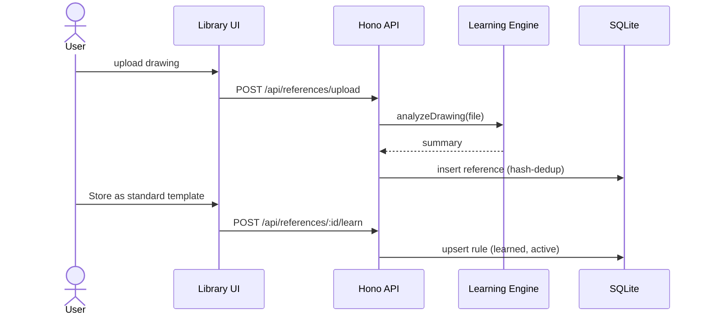

### (b) Generate a design with all elevations (OK)
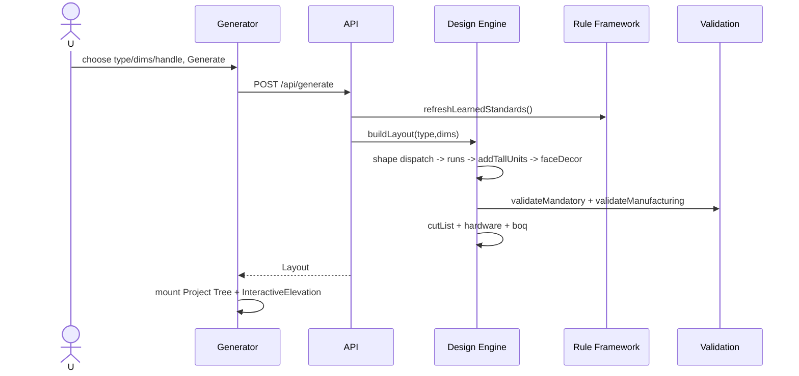

### (c) Edit on one elevation, all views update (edit + single-client propagation OK; cross-client WS roadmap)
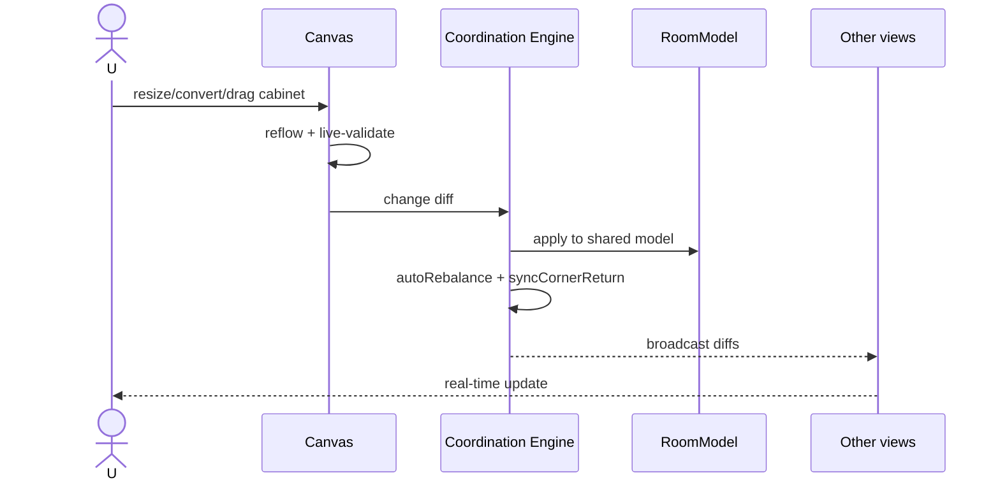

### (d) Beam/structural obstruction auto-reconfiguration (OK 2D+3D elements + beam trim; full multi-view auto-reconfig roadmap)
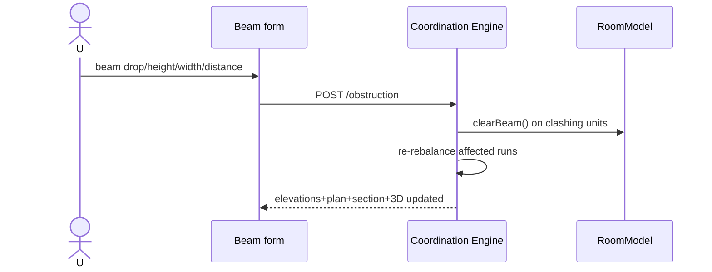

### (e) Project Tree navigation (OK)
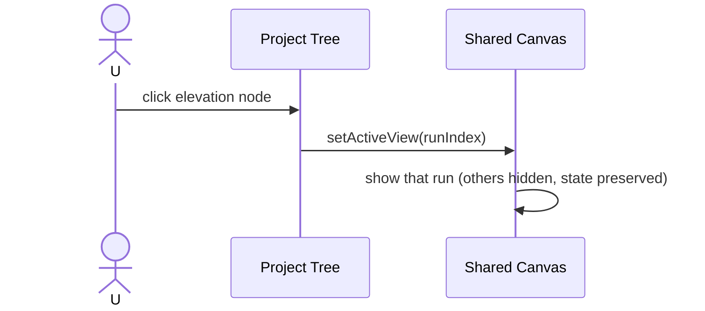

### (f) Auto-rebalance after manual change (OK)
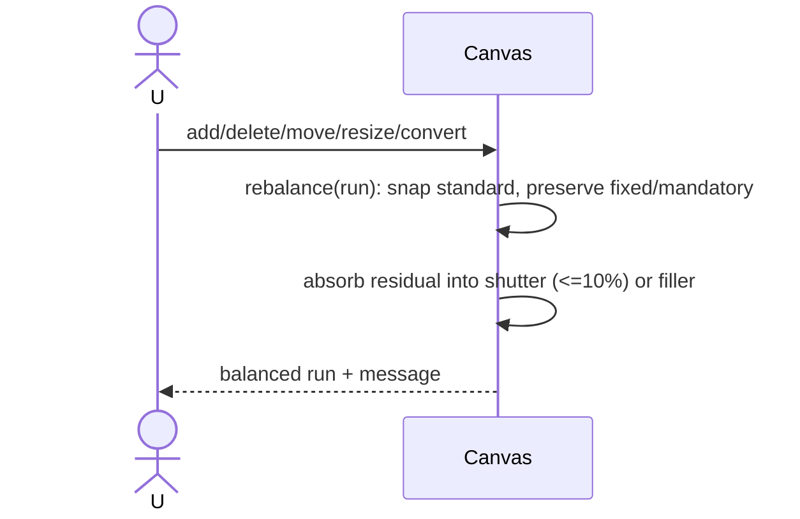

### (g) 2D-to-3D conversion (OK — client-side Three.js)
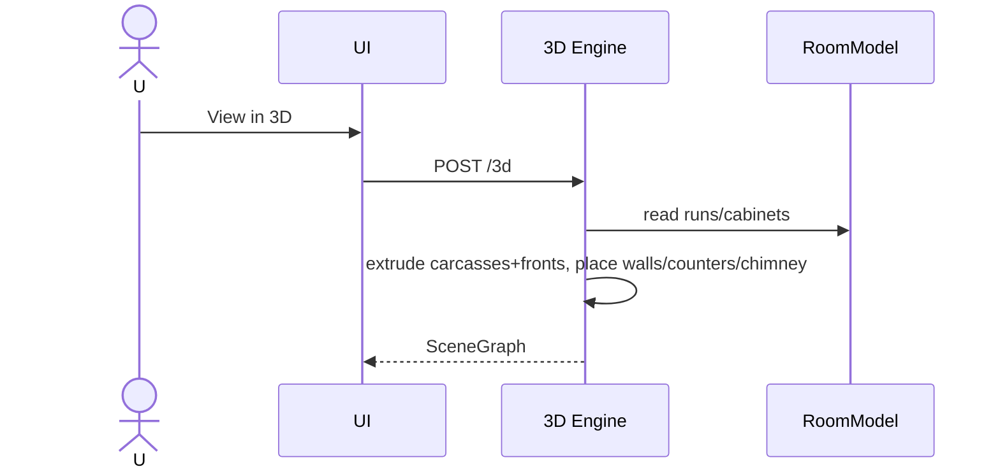

### (h) Real-time rendering & material update (OK — client-side WebGL)
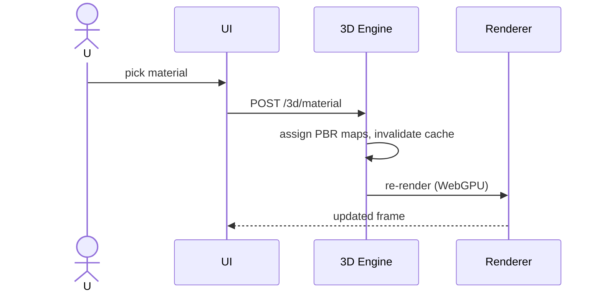

### (i) Scene population (OK — client-side `populate()`)
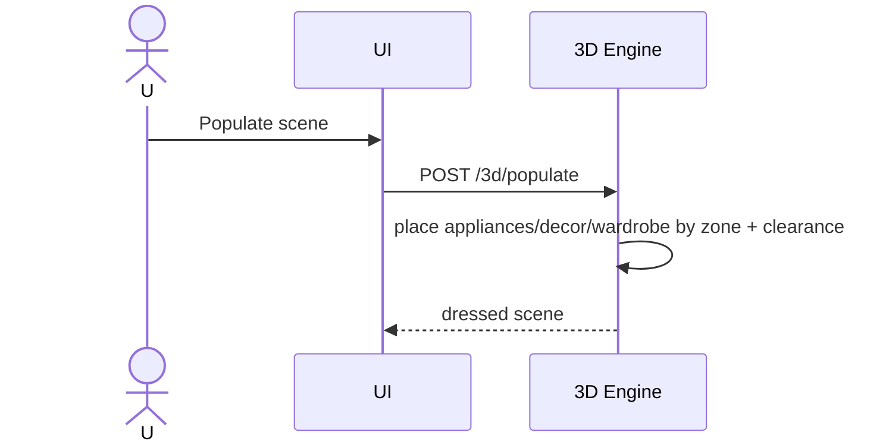

### (j) Walkthrough generation (OK interactive orbit; video encode roadmap)
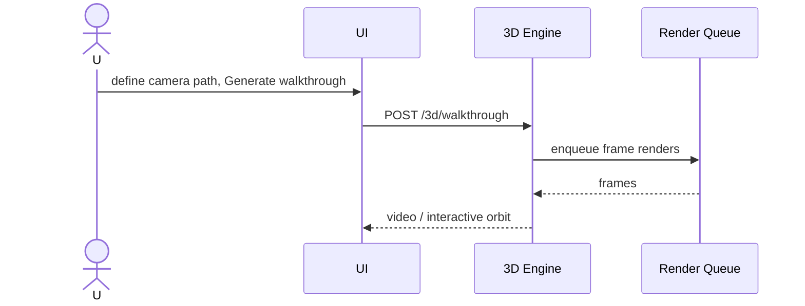

---

## 8. Key Risks & Mitigations

| # | Risk | Impact | Mitigation |
|---|---|---|---|
| 1 | Constraint creep toward cutting/nesting | Violates hard constraint | Cut list reporting-only; no sheet/stock model; review gate; stated explicitly |
| 2 | Dual renderers drift (server faceDecor vs client faceEls) | Elevation/export mismatch | Shared geometry helpers; verify-*.mjs parity tests; long-term shared module |
| 3 | DXF layer mis-classification on recolor | Broken CAD layers | classifyLayer keys off fixed hex; new colors avoid SOCKET_COLORS/reserved; dxf-parser round-trip |
| 4 | Rule-toggle regressions | Unexpected output | Mandatory overrides learned + logs conflicts; deterministic FUNC_ROT reset |
| 5 | In-browser Babel + CDN in prod | Slow first paint / outage | Pre-compile/bundle; self-host vendored libs; SRI pins |
| 6 | SQLite write contention at scale | Throughput ceiling | WAL mode; migrate to Postgres; keep engine pure |
| 7 | Multi-view propagation correctness (roadmap) | Inconsistent room model | Single source-of-truth RoomModel; idempotent propagate; property-based tests |
| 8 | 3D performance on large rooms (roadmap) | Jank / GPU memory | WebGPU + instancing + LOD; offload photoreal to async queue; cap realtime complexity |
| 9 | Manufacturing-validity gaps | Non-buildable output | validateManufacturing gate surfaced before approval; extend with handle-collision + appliance-swing |
| 10 | Headless PDF/test flakiness | CI false negatives | Capture PDF via URL.createObjectURL intercept; poll-with-settle; pin Chrome path |
| 11 | Knowledge-base poisoning from bad uploads | Degraded standards | Confidence caps; content-hash dedup; mandatory rules immutable; human template gate |

---

## Appendix A — Mandatory rule families honored (5.1-5.8)
Chimney-drawer-glass master rule (fixed centred 3-drawer, zone = drawer+50mm, equal glass), no-4-drawer cap, sink-near-corner + GTPT, corner hierarchy (LeMans > Magic > Blind > Carousel), work-triangle bounds, zone/function-first planning, tall-unit feasibility, filler minimization, symmetry, Indian storage set (cutlery/atta/bottle/spice/plate/grocery/thali/utility), handle-system shutter-size effects, manufacturing validation.

## Appendix B — Build/run
`npm start` -> `tsx index.ts` (port 3000). DB `design-studio.db` seeds 10 references + ~23 foundational rules on first boot. Desktop launcher: `AI-Design-Studio.bat` (app-window Chrome) / `launch.vbs` (hidden). Verification: `node verify-*.mjs` (puppeteer-core headless, zero-console-error gate).
